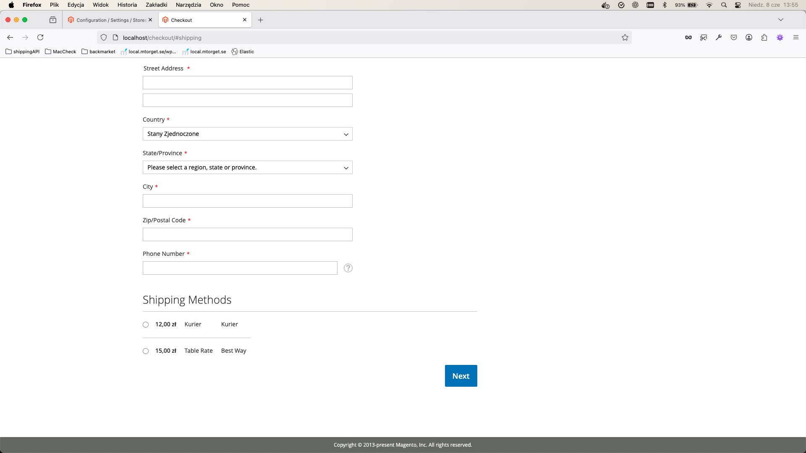

# Magento 2: Sklep z wysyłką kurierską (Flat Rate)

## Opis projektu

Projekt to środowisko Magento 2 uruchamiane w Dockerze, z gotową konfiguracją wysyłki kurierskiej (płaska stawka 12 zł) oraz autorskim modułem `Vendor_ShippingInfo`, który wyświetla cenę wysyłki na stronie produktu.

---

## Zrzuty ekranu

**Strona produktowa z ceną wysyłki:**



**Panel admina – konfiguracja Flat Rate:**


---

## Jak zmienić cenę wysyłki?

### 1. Przez panel admina

1. Zaloguj się do panelu admina Magento.
2. Przejdź do: **Sklepy → Konfiguracja → Sprzedaż → Metody wysyłki → Flat Rate**
3. Ustaw pole "Cena" (Price) na nową wartość (np. 15.00).
4. Zapisz konfigurację i wyczyść cache Magento.

### 2. Przez CLI

W terminalu wpisz:
```bash
docker exec -it magento php bin/magento config:set carriers/flatrate/active 1
docker exec -it magento php bin/magento config:set carriers/flatrate/title "Kurier"
docker exec -it magento php bin/magento config:set carriers/flatrate/name "Kurier"
docker exec -it magento php bin/magento config:set carriers/flatrate/type O
docker exec -it magento php bin/magento config:set carriers/flatrate/price 12
docker exec -it magento php bin/magento cache:flush
```
---

## Opis działania modułu `Vendor_ShippingInfo`

- Moduł wyświetla na stronie produktu aktualną cenę wysyłki kurierskiej (pobieraną z konfiguracji Magento: Flat Rate).
- Blok pojawia się automatycznie na każdej stronie produktu.
- Cena jest dynamiczna – każda zmiana w panelu admina lub przez CLI jest od razu widoczna na froncie.
- Kod modułu znajduje się w katalogu: `magento/app/code/Vendor/ShippingInfo`

---

## Autor

Magento + Docker + Vendor_ShippingInfo – gotowe środowisko developerskie z dynamiczną informacją o wysyłce na karcie produktu.

## Wymagania

- Docker
- Docker Compose
- Git

## Kroki instalacji

1. Sklonuj repozytorium:
```bash
git clone https://github.com/zespol-it/Ageno-Magento-Assessment-Skills.git
```

2. Uruchom kontenery:
```bash
docker-compose up -d
```

3. Zainstaluj Magento używając Composera:
```bash
docker exec -it magento composer create-project --repository-url=https://repo.magento.com/ magento/project-community-edition .
```

4. Ustaw odpowiednie uprawnienia:
```bash
docker exec -it magento chown -R www-data:www-data /var/www/html
docker exec -it magento chmod -R 777 /var/www/html/var
docker exec -it magento chmod -R 777 /var/www/html/generated
```

5. Zainstaluj Magento:
```bash
docker exec -it magento php bin/magento setup:install \
  --base-url=http://localhost/ \
  --db-host=mariadb \
  --db-name=magento \
  --db-user=magento \
  --db-password=magento \
  --admin-firstname=Admin \
  --admin-lastname=User \
  --admin-email=g.skotniczny@gmail.com \
  --admin-user=admin \
  --admin-password=admin123 \
  --language=pl_PL \
  --currency=PLN \
  --timezone=Europe/Warsaw \
  --use-rewrites=1
```

6. Zainstaluj dane przykładowe:
```bash
docker exec -it magento php bin/magento sampledata:deploy
docker exec -it magento composer update
docker exec -it magento php bin/magento setup:upgrade
```

7. Skonfiguruj Elasticsearch:
```bash
docker exec -it magento php bin/magento config:set catalog/search/engine elasticsearch7
docker exec -it magento php bin/magento config:set catalog/search/elasticsearch7_server_hostname elasticsearch
docker exec -it magento php bin/magento config:set catalog/search/elasticsearch7_server_port 9200
```

8. Skonfiguruj Redis dla cache:
```bash
docker exec -it magento php bin/magento setup:config:set --cache-backend=redis --cache-backend-redis-server=redis --cache-backend-redis-port=6379
docker exec -it magento php bin/magento setup:config:set --page-cache=redis --page-cache-redis-server=redis --page-cache-redis-port=6379
docker exec -it magento php bin/magento setup:config:set --session-save=redis --session-save-redis-host=redis --session-save-redis-port=6379
```

9. Skonfiguruj RabbitMQ:
```bash
docker exec -it magento php bin/magento setup:config:set --amqp-host=rabbitmq --amqp-port=5672 --amqp-user=guest --amqp-password=guest
```

10. Włącz tryb deweloperski i wyczyść cache:
```bash
docker exec -it magento php bin/magento deploy:mode:set developer
docker exec -it magento php bin/magento cache:clean
docker exec -it magento php bin/magento cache:flush
```

## Dostęp

- Frontend Magento: http://localhost
- Panel Admin: http://localhost/admin
  - Login: admin
  - Hasło: admin123
- Elasticsearch: http://localhost:9200
- RabbitMQ Management: http://localhost:15672
  - Login: guest
  - Hasło: guest
- Varnish: http://localhost:8080

## Dane dostępowe do bazy

- Host: mariadb
- Baza danych: magento
- Użytkownik: magento
- Hasło: magento
- Hasło root: root

## Konfiguracja usług

### Elasticsearch
- Host: elasticsearch
- Port: 9200
- Bezpieczeństwo: Wyłączone (dla środowiska deweloperskiego)
- Pamięć: 512MB przydzielone

### Redis
- Host: redis
- Port: 6379
- Używany dla: cache, sesje, page cache

### RabbitMQ
- Host: rabbitmq
- Port: 5672 (AMQP)
- Port: 15672 (Management UI)
- Użytkownik: guest
- Hasło: guest

### Varnish
- Port: 8080
- Cache HTTP dla lepszej wydajności

## Uwagi

- Dane MariaDB są przechowywane w wolumenie Docker
- Dane Elasticsearch są przechowywane w wolumenie Docker
- Dane Redis są przechowywane w wolumenie Docker<your-repository-url>
- Dane RabbitMQ są przechowywane w wolumenie Docker
- Pliki Magento są montowane z lokalnego katalogu `magento`
- Nginx jest skonfigurowany do obsługi aplikacji Magento
- Język domyślny: Polski (pl_PL)
- Waluta: PLN
- Strefa czasowa: Europe/Warsaw 